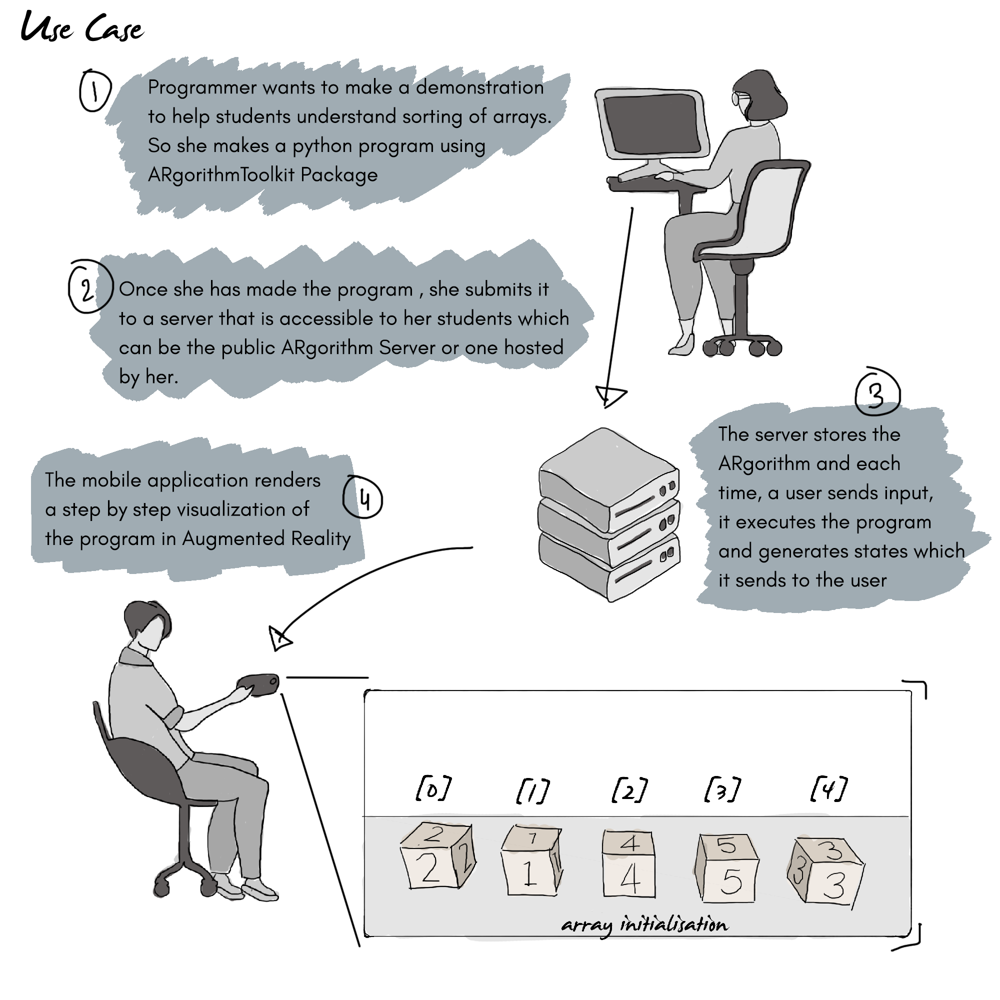

    ARgorithm
    

ARgorithm is a project aimed to provide educators and enthusiasts a tool to create AR visualizations explaining the workings of data structures and algorithms with ease. In recent times , there has been a rise in interest in programming education and this tool is designed to bring Augmented reality into the mix by making it easy to design dynamic and complex visualizations in augmented reality that are accessible to everyone free of cost.
How does it work ?

The project consists of three parts

- toolkit
- Server
- Mobile application

The toolkit package is for developers who want to transport their own algorithms into augmented reality. The toolkit provides you with a template library which works just like your usual template library except this one records states . Each state is an event that occurs in your data structure and by keeping track of the states of your variables , data structures etc we then render them in augmented reality.

The server takes the ARgorithm and runs it with custom user input to generate states which the mobile application converts to AR visualizations.

- The code used to create these visualizations is called `argorithm`.
- The people interacting with the project have been classified into `programmer` and `user`. The `programmer` creates and manages argorithm. The `user` interact with augmented reality visualizations of `argorithm`.

